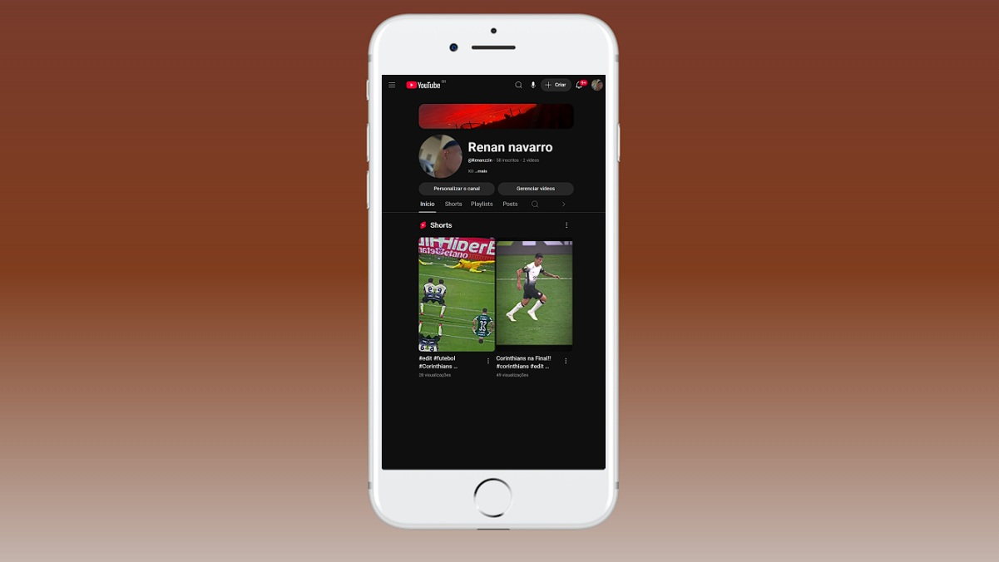

Projeto Rede social

# 📱 Projeto Social

Uma interface interativa inspirada em redes sociais, desenvolvida com foco em responsividade, experiência visual e criatividade no front-end.

## 🚀 Sobre o projeto

O **Projeto Social** foi criado para praticar conceitos modernos de desenvolvimento front-end, simulando uma experiência interativa em um dispositivo mobile dentro da própria interface.

O projeto possui:

* Interface inspirada em redes sociais
* Simulação visual de smartphone
* Navegação interativa
* Layout moderno e responsivo
* Estrutura organizada e visual imersivo

## 🛠️ Tecnologias utilizadas

* HTML5
* CSS3
* JavaScript
* Git & GitHub

## 📱 Responsividade

O projeto foi desenvolvido para funcionar em diferentes dispositivos:

* 💻 Desktop
* 📱 Smartphones
* 📲 Tablets

## ✨ Funcionalidades

* Interface mobile simulada
* Navegação dinâmica
* Ícones interativos
* Layout moderno
* Estrutura responsiva

## 🎯 Objetivos do projeto

* Evoluir habilidades em front-end
* Melhorar criação de interfaces
* Trabalhar posicionamento e responsividade
* Desenvolver experiências visuais modernas
* Praticar interatividade com JavaScript

## 🌐 Deploy

Acesse o projeto online:

👉 https://renannavarro016.github.io/projeto-social/

## 📸 Preview



## 📂 Como executar o projeto

```bash id="e1q2t9"
# Clone o repositório
git clone https://github.com/seuusuario/projeto-social.git

# Abra o index.html
```

## 👨‍💻 Desenvolvedor

Desenvolvido por Renan Navarro.

## 📌 Status

✅ Projeto finalizado
